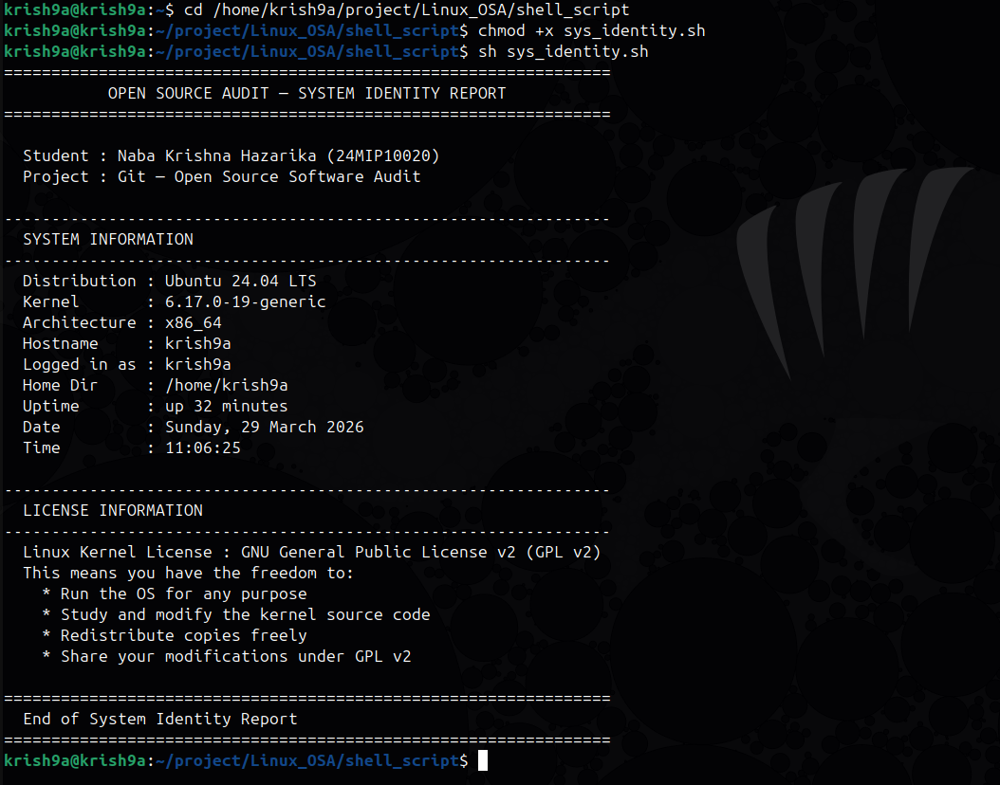
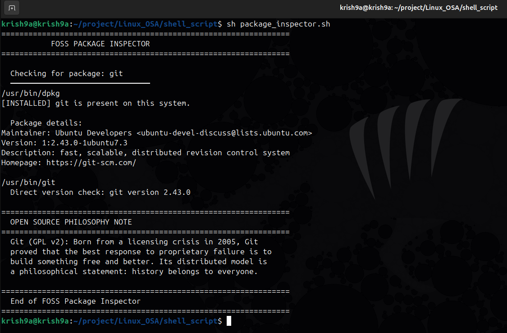
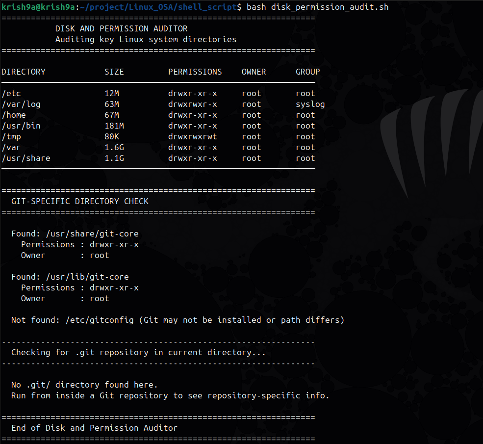
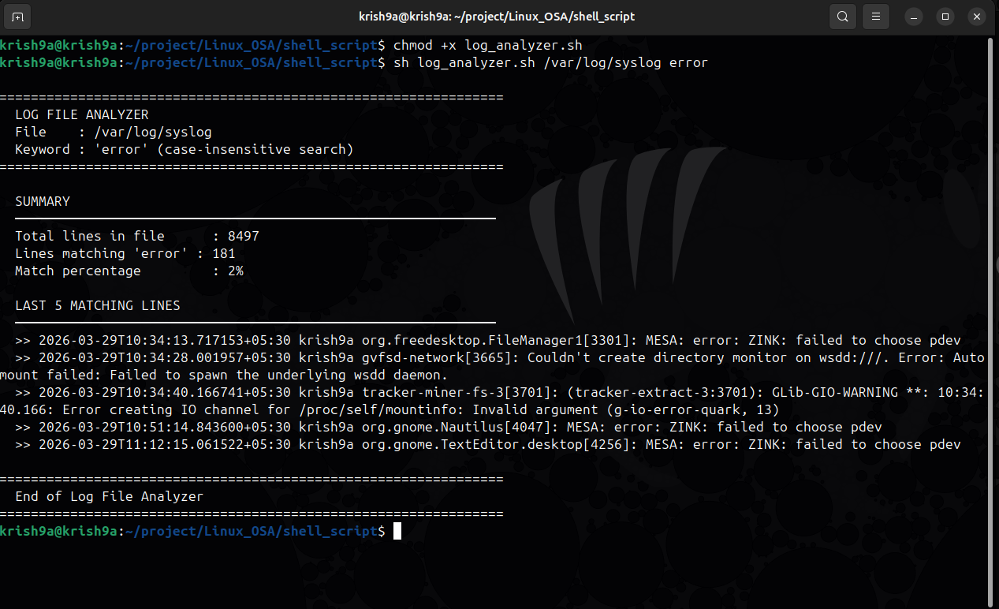
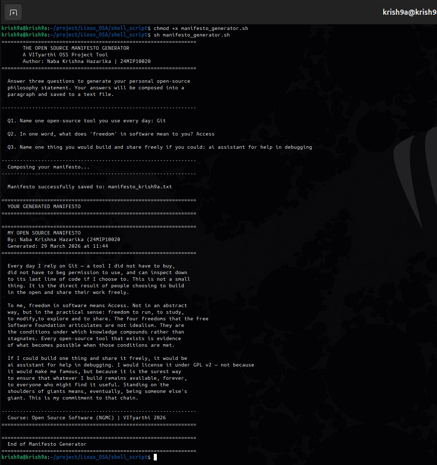

# 🐚 The Open Source Audit: Shell Script Suite

**Course:** Open Source Software (NGMC) | VIT Bhopal University | AY 2025-26
**Student:** Naba Krishna Hazarika | Registration No. 24MIP10020
**License:** GNU General Public License v2.0
**Submission Date:** 24th March 2026

---

## Table of Contents

- [Project Overview](#project-overview)
- [Shell Scripts](#shell-scripts)
- [Script Output Screenshots](#script-output-screenshots)
- [Prerequisites](#prerequisites)
- [How to Run](#how-to-run)
- [Project Structure](#project-structure)
- [License & Ethics](#license--ethics)
- [Acknowledgements](#acknowledgements)

---

## Project Overview

This repository contains the practical component of **"The Open Source Audit"** capstone project. It features five specialized shell scripts designed to demonstrate core Linux administration skills, automation, and the practical application of open-source philosophy.

Each script explores a distinct area of Linux system administration — from identity reporting and package inspection to disk auditing, log analysis, and open-source advocacy — while reinforcing the core tenets of the FOSS ecosystem.

---

## Shell Scripts

All five scripts are located in the `shell_scripts/` directory of this repository.

### 1. 🖥️ System Identity Report — `sys_identity.sh`

Generates a system welcome screen displaying the kernel version, logged-in user, and system uptime. Also prints the license covering the Linux kernel and summarizes the four GPL freedoms.

**Key Concepts:**
- Command substitution
- Variables
- Output formatting

---

### 2. 📦 FOSS Package Inspector — `package_inspector.sh`

Checks if specific open-source software (like MySQL or Apache) is installed and provides a philosophical summary of the tool. Works on both Debian/Ubuntu systems using `dpkg` and on Fedora/RHEL systems using `rpm`.

**Key Concepts:**
- `if-then-else` logic
- `case` statements
- Command detection and nested conditionals

---

### 3. 🔒 Disk and Permission Auditor — `disk_permission_audit.sh`

Audits critical system directories (e.g., `/etc`, `/var/log`) to report disk usage and security permissions. Prints a formatted table showing disk usage, permissions, owner, and group for each directory.

**Key Concepts:**
- `for` loops and Bash arrays
- `ls`, `df`, and `stat` commands
- Column-aligned output formatting with `awk`

---

### 4. 📋 Log File Analyzer — `log_analyzer.sh`

Accepts a log file path and a search keyword as command-line arguments. Scans the file line by line, counts matching lines, calculates the match percentage, and prints the last five matching entries. Includes a retry mechanism for invalid paths.

**Key Concepts:**
- `while-read` loops
- Command-line arguments (`$1`, `$2`)
- Integer arithmetic and parameter expansion

---

### 5. ✊ Open Source Manifesto Generator — `manifesto_generator.sh`

An interactive tool that collects user input to generate a personalized `.txt` manifesto regarding software freedom. Saves output to a file named after the current user.

**Key Concepts:**
- User input (`read`) with validation
- File redirection (`>>`)
- String interpolation and concatenation

---

## Script Output Screenshots

The `results/` directory contains screenshots of each script running successfully on a Linux system.

| Script | Screenshot |
|--------|------------|
| System Identity Report |  |
| FOSS Package Inspector |  |
| Disk and Permission Auditor |  |
| Log File Analyzer |  |
| Manifesto Generator |  |

---

## Prerequisites

- A Linux operating system (Ubuntu, Debian, Fedora, Arch, or openSUSE)
- Bash shell
- Standard Linux core utilities: `grep`, `awk`, `sed`, `df`, `ls`, `stat`, `uptime`, `whoami`, `date`

No additional packages need to be installed on a standard modern Linux system.

---

## How to Run

**1. Clone the repository:**

```bash
git clone <your-repo-url>
cd <Linux_OSA>
```

**2. Grant execution permissions:**

```bash
chmod +x shell_scripts.sh
```

**3. Execute a script:**

```bash
# Script 1 – System identity and license info
sh sys_identity.sh or bash sys_identuty.sh

# Script 2 – Inspect an installed FOSS package (e.g., git)
sh package_inspector.sh git

# Script 3 – Audit key system directories and permissions
sh disk_permission_audit.sh

# Script 4 – Analyze a log file for a keyword (e.g., ERROR)
sh log_analyzer.sh /var/log/syslog ERROR

# Script 5 – Interactively generate your open source manifesto
sh manifesto_generator.sh
```

> Detailed usage and argument descriptions are available as comments at the top of each script file.

---

## Project Structure

```
LINUX_OSA/
│
├── results/
│   ├── disk_permission_audit.png
│   ├── log_analyzer.png
│   ├── manifesto_generator.png
│   ├── package_inspector.png
│   └── sys_identity.png
│
├── shell_scripts/
│   ├── disk_permission_audit.sh
│   ├── log_analyzer.sh
│   ├── manifesto_generator.sh
│   ├── manifesto_krish9a.txt
│   ├── package_inspector.sh
│   └── sys_identity.sh
│
└── Readme.md
```

---

## License & Ethics

These scripts are developed as part of an academic audit exploring the ethics of **"standing on the shoulders of giants"**. The code is shared freely to demonstrate the transparency and collaborative nature of the FOSS ecosystem.

All shell scripts in this project are licensed under the **GNU General Public License v2.0**.

This project embraces the four essential freedoms of free software:

| Freedom | Description |
|---------|-------------|
| **Freedom 0** | Run the program for any purpose |
| **Freedom 1** | Study and modify the source code |
| **Freedom 2** | Redistribute copies |
| **Freedom 3** | Distribute modified versions |

Full license text: https://www.gnu.org/licenses/old-licenses/gpl-2.0.en.html

---

## Acknowledgements

Special thanks to the open-source community whose tools, documentation, and philosophy made this project possible. *We build on what others have shared freely before us.*

**References:**
1. GNU Project. The Free Software Definition — https://www.gnu.org/philosophy/free-sw.html
2. Open Source Initiative. The Open Source Definition — https://opensource.org/osd
3. Shotts, W. The Linux Command Line — https://linuxcommand.org
4. GNU Bash Manual — https://www.gnu.org/software/bash/manual/

---


VIT Bhopal University | School of Computer Science and Engineering | Open Source Software (NGMC) | AY 2025-26